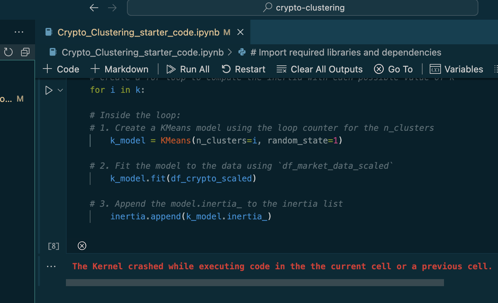

# crypto-clustering
I could not get this to run successfully. The kernel kept dying at cell 8, and I was unable to discern why despite a lot of Googling. It seems to be some sort of memory issue, but I was unable to resolve it despite restarting both VS Code and my computer. See image below of the error.

